# Описание
Jira Task Manager — это полнофункциональное веб-приложение для управления задачами с интерфейсом Kanban-доски. Проект позволяет организовывать работу, отслеживать прогресс выполнения задач и работать с задачами в едином пространстве.

## Функционал

### Управление задачами
* ~~Создание и редактирование задач: Поддержка операций создания, просмотра, изменения и удаления задач.
* **Канбан-доска:** Визуализация задач с возможностью перемещения между статусами.
* **Приоритизация:** Поддержка приоритетов задач — низкий, средний, высокий и критичный.
* **​Статусы:** Отслеживание состояния задач по этапам выполнения.
* **​Детальная информация:** Работа с описанием, временными оценками и фактическим временем выполнения.

### Система пользователей
* **Регистрация и авторизация:** Реализована система аутентификации с использованием JWT.
* **​Ролевая система:** Управление правами доступа пользователей.
* **​Профили:** Для пользователей предусмотрена отдельная сущность и работа с учетными данными.

### Статистика и аналитика
* **История:** Полный журнал всех изменений по задачам.
* **​Отчёты:** Детальная статистика по задачам и проектам.

## Технологический стек

| Компонент | Технология |
|-----------|------------|
| **Бэкенд** | Java 21, Spring Boot 4.0.3  |
| **Фронтенд** | Vue 3, TypeScript, Vite |
| **База данных** | PostgreSQL 15 |
| **ORM** | Spring Data JPA, Hibernate |
| **Аутентификация** | JWT (JSON Web Tokens) |
| **Контейнеры** | Docker, Docker Compose |

## Установка и запуск

### 1. Клонирование репозитория

```bash
git clone https://github.com/RigLatvin-lang/jira/tree/master/jira
cd Uplink
```   

### 2. Запуск проекта

1. Убедитесь, что запущен Docker.
2. Откройте проект в VS Code.
3. Запустите файл compose.yaml
Это автоматически поднимет базу данных PostgreSQL и бэкенд на Java.

### 3. Запуск фронтенда
1. Откройте встроенный терминал в VS Code и перейдите в директорию фронтенда
2. Выполните поочередно две команды:
```bash
npm install
npm run dev
```   
### 4. Готово!

* **Веб-приложение доступно по адресу:** [http://localhost:5173](http://localhost:5173)
* **API бэкенда доступно по адресу** [http://localhost:8080](http://localhost:8080)

## Тестирование

2. Перейдите в директорию `src/test/java/org/aur/jira/usecase`.
3. Нажмите правой кнопкой мыши по нужным файлам и выберите **"Run"** (Запустить):
   - `AuthUseCaseTest.java` — для запуска тестов логики авторизации и регистрации.
   - `TaskUseCaseTest.java` — для запуска тестов логики управления задачами (Канбан-доска).
   - `JiraApplicationTests.java` — для проверки успешной загрузки Spring-контекста.
## Структура проекта

```mermaid
%%{init: {'theme': 'neutral'}}%%
graph TD
    ROOT["Jira Task Manager/<br/>Корень проекта"] --> BACKEND["backend/<br/>Java Spring Boot сервер"]
    ROOT --> FRONTEND["frontend/<br/>Клиент на Vue 3"]
    ROOT --> CONFIG["Конфигурация и сборка"]
    
    %% BACKEND СТРУКТУРА
    BACKEND --> MAIN["src/main/java/<br/>Исходный код бэкенда"]
    BACKEND --> TEST["src/test/java/<br/>Тесты бэкенда"]
    
    MAIN --> CONFIG_DIR["config/<br/>Настройки безопасности, Swagger и JWT"]
    MAIN --> CONTROLLER["controller/<br/>REST API контроллеры"]
    MAIN --> DOMAIN["domain/<br/>Сущности БД и Enums"]
    MAIN --> DTO["dto/<br/>Объекты передачи данных (Request/Response)"]
    MAIN --> REPOSITORY["repository/<br/>Интерфейсы для работы с БД (JPA)"]
    MAIN --> USECASE["usecase/<br/>Бизнес-логика приложения"]
    
    CONTROLLER --> API_FILE["TaskController, AuthController<br/>Обработка HTTP запросов от фронтенда"]
    USECASE --> LOGIC_FILE["TaskUseCase, AuthUseCase<br/>Ядро логики управления задачами и пользователями"]
        
    %% FRONTEND СТРУКТУРА
    FRONTEND --> SRC["src/<br/>Исходный код фронтенда"]
        
    SRC --> COMPONENTS["components/<br/>Переиспользуемые UI компоненты"]
    SRC --> VIEWS["views/<br/>Страницы приложения (Доска, Профиль)"]
    SRC --> STORES["stores/<br/>Управление состоянием с помощью Pinia"]
    SRC --> API_FRONT["api/<br/>Настройка Axios для запросов к бэкенду"]
    SRC --> ROUTER["router/<br/>Настройки маршрутизации Vue Router"]
     
    %% КОНФИГУРАЦИЯ
    CONFIG --> DOCKER_COMPOSE["compose.yaml<br/>Конфигурация Docker контейнеров (БД + App)"]
    CONFIG --> GRADLE["build.gradle<br/>Файл зависимостей Java и настройки сборки"]
    CONFIG --> PACKAGE["package.json<br/>Файл зависимостей npm для фронтенда"]
      
    %% СТИЛИ ДЛЯ ВИЗУАЛИЗАЦИИ
    classDef backend fill:#e1f5fe,stroke:#01579b,stroke-width:2px
    classDef frontend fill:#e8f5e9,stroke:#2e7d32,stroke-width:2px
    classDef config fill:#fff3e0,stroke:#f57f17,stroke-width:2px
    
    class BACKEND,MAIN,TEST,CONFIG_DIR,CONTROLLER,DOMAIN,DTO,REPOSITORY,USECASE backend
    class FRONTEND,SRC,COMPONENTS,VIEWS,STORES,API_FRONT,ROUTER frontend
    class CONFIG,DOCKER_COMPOSE,GRADLE,PACKAGE config

```


## План развития

* **Интеграция WebSockets** Реализация обновления Kanban-доски в реальном времени для всех пользователей без перезагрузки страницы.
* **Тайм-трекинг:** Встроенный секундомер для точного отслеживания затраченного на задачи времени.
* **Система уведомлений:** Email-рассылки и уведомления внутри приложения об изменениях статуса задач или новых комментариях.
